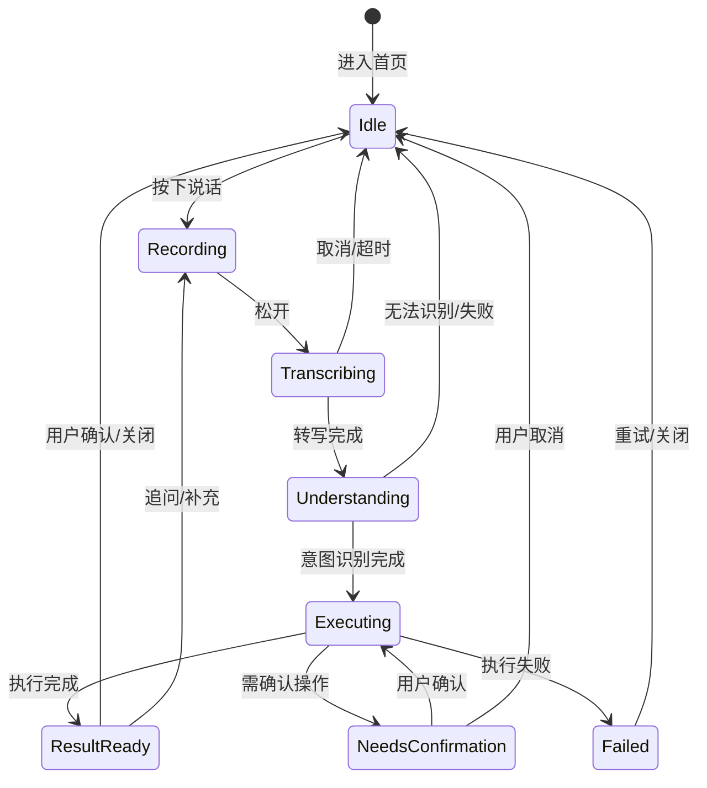
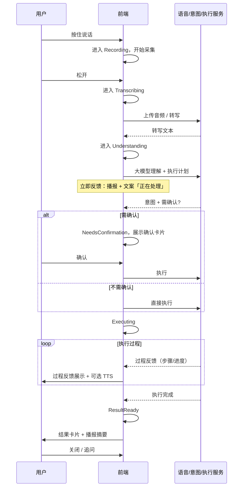

# 按住说话到执行反馈的完整语音交互闭环

本文档定义从「按住说话」到「执行反馈」的端到端语音交互闭环。

语音闭环是管理者与 Agent Teams 之间的一种交互通道（产品还支持文字和图片输入）。
完整产品架构见 [docs/prd.md](prd.md) 和 [docs/technical-architecture.md](technical-architecture.md)。

## 1. 设计原则

- **Push-to-Talk 优先**：按住说话 → 实时转写 → 松开即执行，不做持续唤醒陪聊。
- **输出不唯语音**：语音播报 + 卡片化结果 + 一键确认按钮。
- **反馈分层**：立即反馈 → 过程反馈 → 结果反馈 → 风险反馈（需确认时）。
- **不预定义指令类型**：任意指令由大模型理解，Agent Teams 执行。

## 2. 交互闭环总览



## 3. 状态定义

| 状态 | 英文 ID | 说明 | 用户可见表现 |
|------|---------|------|----------------|
| 空闲 | `Idle` | 等待用户按下说话 | 大按钮「按住说话」、最近任务/待确认入口 |
| 录音中 | `Recording` | 用户按住，正在采集语音 | 波形/音量指示、实时转写（可选） |
| 转写中 | `Transcribing` | 松开后，语音转文字 | 「正在识别…」 |
| 理解中 | `Understanding` | 大模型意图识别、生成执行计划 | 「正在理解您的指令…」 |
| 执行中 | `Executing` | Agent Teams 执行中 | 过程反馈文案 + 进度/步骤 |
| 需确认 | `NeedsConfirmation` | 高风险操作等待用户确认 | 确认卡片 + 确认/取消按钮 |
| 结果就绪 | `ResultReady` | 执行完成，等待用户查看 | 结果卡片 + 播报 + 可选操作 |
| 失败 | `Failed` | 某步失败 | 失败原因 + 建议补救 + 重试/关闭 |

## 4. 事件与流转

### 4.1 用户侧事件

| 事件 | 触发方式 | 典型流转 |
|------|----------|----------|
| `press_start` | 按下说话按钮 | Idle → Recording |
| `press_end` | 松开说话按钮 | Recording → Transcribing |
| `cancel` | 取消/返回 | Recording/Transcribing → Idle |
| `confirm` | 点击确认 | NeedsConfirmation → Executing |
| `reject` | 点击取消 | NeedsConfirmation → Idle |
| `dismiss` | 关闭结果/任务卡片 | ResultReady/Failed → Idle |
| `follow_up` | 追问/补充（再次按住说话） | ResultReady → Recording |

### 4.2 系统侧事件

| 事件 | 产生时机 | 典型流转 |
|------|----------|----------|
| `transcribe_done` | 转写结果返回 | Transcribing → Understanding |
| `transcribe_fail` | 转写失败/超时 | Transcribing → Idle 或 Failed |
| `intent_ready` | 大模型理解+执行计划就绪 | Understanding → Executing 或 NeedsConfirmation |
| `intent_fail` | 无法识别/缺失参数 | Understanding → Idle 或追问 |
| `execution_progress` | 执行过程更新 | 保持 Executing，更新过程反馈 |
| `execution_done` | 执行成功结束 | Executing → ResultReady |
| `execution_fail` | 某步执行失败 | Executing → Failed |
| `confirmation_required` | 需要用户确认 | Executing → NeedsConfirmation |

## 5. 反馈分层规范

### 5.1 立即反馈（Instant）

- **时机**：松开后进入 Transcribing/Understanding 时立即给出。
- **内容**：一句短文案，表明「已收到、正在处理」。
- **形式**：语音播报（TTS） + 界面文案。
- **示例**：「好的，正在处理您的指令。」

### 5.2 过程反馈（Progress）

- **时机**：Executing 期间，每有阶段进展即可推送。
- **内容**：当前步骤描述（如「正在查询华东区销量」「正在生成简报」）。
- **形式**：界面文案/步骤条 + 可选短 TTS（可配置为静默）。
- **示例**：「正在查华东区昨日销量异常门店。」

### 5.3 结果反馈（Result）

- **时机**：Executing → ResultReady。
- **内容**：执行结果摘要、关键数据、可操作项。
- **形式**：结果卡片（标题 + 正文 + 列表/表格/按钮）+ 语音播报摘要（可关闭）。
- **示例**：卡片「已查到 3 家异常门店」+ 列表 + 「生成简报」按钮。

### 5.4 风险反馈（Confirmation）

- **时机**：涉及审批、分配、写操作等需授权时，进入 NeedsConfirmation。
- **内容**：即将执行的动作描述、影响范围、确认/取消。
- **形式**：确认卡片 + 明确「确认」「取消」按钮，必要时播报「请确认是否执行 xxx」。
- **示例**：「将把客户张三分给上海团队并生成跟进任务，是否确认？」

## 6. 端到端时序（单次指令）



## 7. 异常与边界

- **录音过短/静音**：松开后若无效时长，可提示「请再说一次」并回到 Idle。
- **转写超时/失败**：进入 Failed，提示「未能识别，请重试」并保留重试入口。
- **意图无法识别**：可进入 Idle 并提示「暂不支持该指令」或引导到常用指令模板。
- **执行失败**：进入 Failed，必须包含：哪一步失败、原因、建议补救、重试/关闭。
- **打断**：Recording 阶段用户取消则回到 Idle；若未来支持「打断播报」，可在此规范上扩展事件。

## 8. 多任务场景

语音闭环的状态机是**按任务实例**运行的，不是全局单例。在多任务并行场景下：

### 8.1 核心原则

- 每次「松开即执行」产生一条独立**任务**，拥有自己的闭环状态。
- 用户随时可以发起新录音，即使有其他任务正在执行中或待确认。
- 前端维护一个全局输入状态（Recording / Transcribing）和多个任务状态（各自独立的 Executing / NeedsConfirmation / ResultReady / Failed）。

### 8.2 全局输入 vs 任务状态

```
全局输入状态          任务 A 状态          任务 B 状态          任务 C 状态
─────────────        ─────────────        ─────────────        ─────────────
Idle                 Executing            NeedsConfirmation    ResultReady
  ↓ press_start
Recording            Executing            NeedsConfirmation    ResultReady
  ↓ press_end
Transcribing         Executing            NeedsConfirmation    ResultReady
  ↓ transcribe_done
Idle (新任务 D 创建)  Executing            NeedsConfirmation    ResultReady

→ 任务 D 进入 Understanding → Executing
→ 任务 B 不影响，继续等确认
→ 任务 A 不影响，继续跑
```

### 8.3 任务归属判断

松开录音、转写完成后，在进入 Understanding 之前，系统需要判断：

- **新任务**："帮我查一下华东区销量" → 创建新任务，进入独立闭环。
- **旧任务追问**："刚才那个，加一个条件" → 挂到已有任务，以 follow-up 方式处理。
- **不确定**：置信度低时反问用户"这句话是关于哪件事？"

归属判断由大模型在 Understanding 阶段完成，见 `IntentResult.relatedTaskId`。

### 8.4 确认局部阻塞

某任务进入 NeedsConfirmation 时：

- 该任务自身暂停，等待用户确认或取消。
- 其他任务不受影响，继续各自的闭环。
- 用户可以先不确认，去发新指令或处理别的任务。

### 8.5 首页与闭环的关系

- 首页任务流展示所有任务的当前状态，按分层排列（待拍板 → 执行中 → 已完成）。
- 待确认任务在首页置顶，等同于闭环内 NeedsConfirmation 的另一入口。
- 闭环内的确认操作与首页任务流的确认操作是同一数据，仅展示入口不同。

## 9. 实现时的数据类型与接口建议

见仓库内 `src/voice/` 下的类型定义与状态机说明，与本设计一一对应，便于前端与后端对齐实现。

完整功能清单见 [feature-list.md](feature-list.md)。
